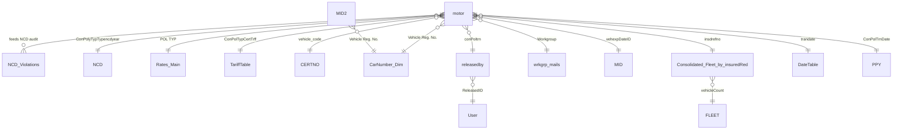

# Data Model and Relationships

The model follows a star-leaning design. `motor` is the central fact and the audit
engine; it carries the raw policy-transaction fields plus the calculated columns that
perform each underwriting check. Reference tables (tariff, NCD, rates), dimensions
(vehicle, user, workgroup, date), and dedicated exception tables surround it.

All figures referenced anywhere in this documentation are illustrative samples, not
real company data.

## Relationship overview

The model also contains a number of auto-generated local date tables (one per date
column) that Power BI creates for its built-in time intelligence. They are omitted
from the diagram for clarity.

## Table inventory

### Fact and audit engine

| Table | Role |
|-------|------|
| `motor` | Central motor policy-transaction fact. Holds raw booked values plus roughly 50 calculated audit columns that recompute expected values and flag exceptions. This is where the underwriting audit actually happens. |
| `Non Motor` | Non-motor policy transactions, kept alongside for completeness of the book. |
| `NCD_Violations` | Curated fact of policies where the No-Claim-Discount looks questionable, used for focused NCD leakage reporting. |

### Reference and rating tables

| Table | Role |
|-------|------|
| `NCD` | Expected NCD band lookup keyed by policy type and NCD year. |
| `Rates_Main` | Main rating reference keyed by policy type. |
| `TariffTable` | Tariff reference keyed by policy type, certificate, and tariff regime. |
| `CERTNO` | Certificate and vehicle-code lookup. |

### Dimensions

| Table | Role |
|-------|------|
| `CarNumber_Dim` | Vehicle registration dimension, shared by the motor fact and the MID tables. |
| `User` | Releasing or underwriting users, joined through `releasedby`. |
| `releasedby` | Bridge between a policy transaction and the user who released it. |
| `wrkgrp_mails` | Workgroup (branch or team) reference with mailing details. |
| `DateTable` | Central date dimension for time intelligence. |
| `PPY` | Prior policy year mapping, supports renewal and prior-cover logic. |

### MID and certificate reconciliation

| Table | Role |
|-------|------|
| `MID` | Motor Insurance Database certificate records, joined to the motor fact for premium, sum insured, and cover-type reconciliation. |
| `MID2` | Second MID extract used for duplicate-registration and certificate checks. |

### Fleet consolidation

| Table | Role |
|-------|------|
| `Consolidated_Fleet_by_insuredRed` | Vehicle counts consolidated by insured reference, used to decide fleet eligibility. |
| `Consolidated_Fleet_by_Name` | Vehicle counts consolidated by insured name. |
| `Consolidated_carNo` | Consolidation by vehicle number. |
| `FLEET` | Fleet band reference keyed by number of vehicles. |

### Exception tables

| Table | Role |
|-------|------|
| `cancelled` | Cancelled policies isolated for follow-up. |
| `Expired` | Expired covers isolated for follow-up. |
| `Duplicate Car Numbers MID2` | Vehicle registrations appearing more than once, a common data-integrity and fraud signal. |
| `CXnb_combo_Table` | Cancellation-versus-new-business combination table for churn and reversal analysis. |

## Data dictionary: key fields

### `motor` (raw, selected)

| Column | Type | Meaning |
|--------|------|---------|
| `polno` / `prevpolno` | text | Current and previous policy numbers. |
| `insdrefno` | text | Insured reference, used for fleet consolidation. |
| `insdname1` | text | Insured name. |
| `cvrtype` | text | Cover type (for example C and F comprehensive, T third-party only). |
| `polprem` | number | Booked policy premium. |
| `siamt` | number | Sum insured amount. |
| `comdate` / `expdate` | date | Commencement and expiry dates. |
| `trandate` / `entdate` | date | Transaction and entry dates. |
| `NCBYR` / `NCBPCT` / `NCBRATE` | number | No-claim-bonus year, percent, and rate as booked. |
| `wkgrp` | text | Releasing workgroup or branch. |

### `motor` (calculated audit columns, selected)

| Column | Verdict it produces |
|--------|---------------------|
| `tarrif_validity` | Which tariff regime applies to the policy based on commencement date. |
| `004_NCD_Charged_check` / `05_Check_NCD_Given` | Whether NCD was correctly applied for the cover type. |
| `06_NCD_Validity` | Whether the NCD year and band are valid. |
| `Comm. Charged Right?` | Commission correctly charged, under-charged, over-charged, or paid on direct business. |
| `OR_Expected_Rate` | Expected overrider commission rate. |
| `TP_basic_premium_check` | Third-party basic premium correctness and risk-classification flags. |
| `POLICY PREMIUM CHARGED RIGHT?` | Total premium rightly charged, under-charged, or a cancellation or reversal. |
| `MIDvsOV3_Prem_Check` / `MIDvsOV3_SI_Check` / `MIDvsOV3_CoverType_Check` | Reconciliation of premium, sum insured, and cover type against the MID record. |
| `Fleet_Application` | Whether fleet rating was correctly applied. |
| `correct cert#` | Whether the certificate number is valid for the vehicle class. |

### `NCD_Violations`

| Column | Type | Meaning |
|--------|------|---------|
| `Current PolNo` / `Previous PolNo` | text | Linked policy numbers across the renewal. |
| `Insured Name` | text | Policyholder. |
| `Prev Cover` / `Curr Cover` | text | Cover type before and after renewal. |
| `Policy Premium` | number | Premium on the violation policy. |
| `NCD Given` | number | Discount granted; negative values represent leakage. |
| `NCB %` | number | No-claim-bonus percent applied. |
| `Report Year` / `Report Month` | text or number | Reporting period for time slicing. |
