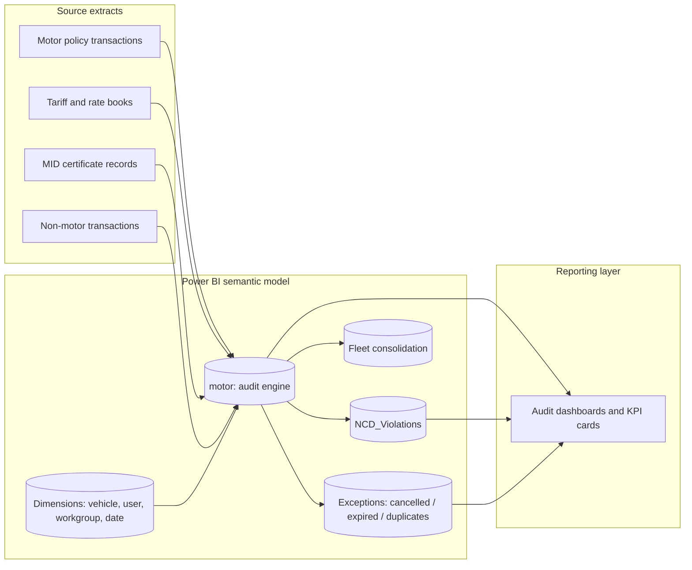

# Non-Life Policy Underwriting Audit (Power BI)

An end-to-end Power BI solution that audits non-life insurance underwriting at the
policy-transaction level. The model recalculates what each motor policy *should*
have been charged, compares it against what was *actually* booked, and flags the
gaps: premium leakage, wrongly applied discounts, commission errors, expired
tariffs, and certificate or Motor Insurance Database (MID) mismatches.

> Note on data: this project was built for an insurer I work with, so all numbers in
> this repository are illustrative sample figures, not real company data. The model
> structure, DAX logic, and audit methodology are mine; the values shown are
> fabricated for demonstration.

---

## Why this exists

In a non-life book, premium leakage rarely comes from one big mistake. It comes from
thousands of small ones: a No-Claim-Discount applied to a third-party-only cover, a
commission paid on direct business, a policy rated on last year's tariff, a
certificate premium that does not reconcile with the regulator's MID record. Spot
checks miss most of these. This model checks every transaction, every time the data
refreshes.

The goal was simple: turn a manual, sample-based underwriting review into an
automated, 100 percent-coverage audit that a QA officer can act on the same day a
policy is released.

---

## What it does

The solution runs a set of independent audit checks on each policy transaction and
returns a plain-language verdict per check, for example "CORRECT NCD",
"NCD WRONGLY APPLIED", "UNDER-CHARGED POLICY PREMIUM", or "MIS-MATCH BY DIFF OF X".
Those verdicts roll up into dashboards that let a reviewer slice leakage by cover
type, branch workgroup, releasing user, tariff regime, and period.

Audit domains covered:

- Policy premium accuracy: expected total premium recomputed from sum insured,
  tariff, perils, and loadings, then compared with the booked premium.
- No-Claim-Discount (NCD) integrity: whether NCD was earned, applied at the right
  band, and not granted on covers that do not qualify.
- Commission and overrider correctness: charged rates versus expected rates, with
  special handling for direct business that should carry no commission.
- Tariff validity: maps each policy's commencement date to the tariff regime that
  was in force, so policies are never audited against the wrong rate book.
- Third-party basic premium and risk classification checks.
- MID reconciliation: premium, sum insured, and cover type on the policy versus the
  Motor Insurance Database certificate record.
- Fleet rating: whether a fleet discount was correctly applied based on consolidated
  vehicle counts per insured.
- Exception surfacing: cancelled policies, expired covers, and duplicate vehicle
  registrations isolated into their own tables for follow-up.

---

## Architecture at a glance



A fuller breakdown of every table, relationship, and the audit logic lives in the
[docs](docs/) folder:

- [Data model and relationships](docs/01-data-model.md)
- [DAX measures](docs/02-dax-measures.md)
- [Underwriting audit checks](docs/03-audit-checks.md)

---

## What the output looks like

For every policy transaction, the model returns a plain-language verdict per check,
which a reviewer can filter into a worklist. Verdicts are categorical, not numeric,
so the reporting layer can quantify and route exceptions without anyone reading
individual policy values. Representative verdict labels include:

- Premium: "POLICY TOTAL PREMIUM RIGHTLY CHARGED", "UNDER-CHARGED POLICY PREMIUM",
  "CANCELLATION | REVERSAL".
- NCD: "CORRECT NCD", "NCD WRONGLY APPLIED", "NCD ON THIRD-PARTY COVER".
- Commission: "CORRECTLY CHARGED", "UNDER CHARGED", "OVER CHARGED COMMISSION",
  "COMMISSION ON DIRECT BUSINESS".
- MID reconciliation: "PREMIUM MATCH", "MIS-MATCH".

From there, the dashboards let a reviewer slice exceptions by cover type, workgroup,
releasing user, tariff regime, and period, then quantify the exposure and route a
worklist back to underwriting for correction.

No portfolio figures, leakage rates, or book-level findings are included in this
repository. The repo documents the engineering and methodology only.

---

## Tech stack

- Power BI Desktop (tabular semantic model, compatibility level 1600)
- Power Query (M) for ingestion and shaping of policy and MID extracts
- DAX for the audit logic: roughly 50 calculated audit columns plus a focused set of
  reporting measures
- Star-ish schema with a central motor fact, conformed date and vehicle dimensions,
  and dedicated exception tables

---

## Repository layout

```
.
|-- README.md                 you are here
|-- docs/
|   |-- 01-data-model.md       tables, relationships, data dictionary
|   |-- 02-dax-measures.md      reporting measures with DAX
|   |-- 03-audit-checks.md      each underwriting check explained
|-- assets/
|   |-- README.md              where to drop dashboard screenshots
|-- .gitignore
|-- LICENSE
```

---

## A note on reproducibility

The .pbix file and any source extracts are intentionally excluded from this
repository (see `.gitignore`), because they contain confidential policyholder and
commercial data. This repo documents the design and methodology so reviewers can
judge the engineering, not the underlying book.

---

## About

Built as part of my work as a data and underwriting-audit analyst in non-life
insurance. If you would like a walkthrough of the model or a live demo on
anonymised data, feel free to reach out.

- Author: Richard Dok
- Contact: dokrichardm@gmail.com
- LinkedIn: linkedin.com/in/dokrichardm
